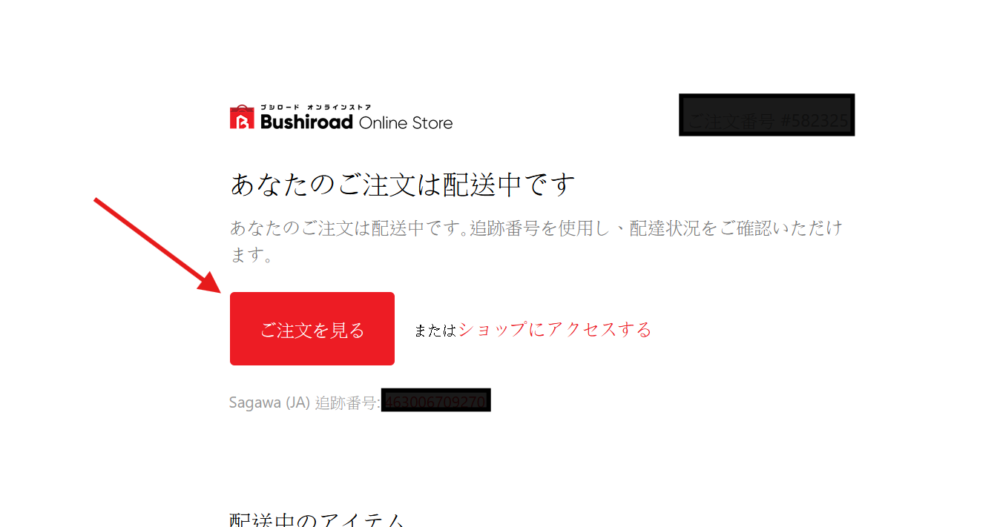

# bns
## 1 Prerequisites 
- Python (I uses python 3.13, but I think other versions are ok)
- Selenium
    - install selenium by:
    ```
    python -m pip install selenium
    ```
- Chrome and chrome driver
    - Latest chromedriver.exe can be installed here:
    https://googlechromelabs.github.io/chrome-for-testing/
    **Please check if chromedriver version matches chrome version**
    > Put the installed chromedriver.exe in C:/. Or update the code for chromedriver.exe location.
    ```py
    # Initialize the Chrome driver
    service = Service(executable_path=r"C:\chromedriver.exe") # Update this path to where you have chromedriver installed
    options = webdriver.ChromeOptions()
    options.add_argument("--window-size=1920,1080")
    driver = webdriver.Chrome(service=service, options=options)
    ```

## 2 Usage
- Run the program by 
    ```
    python bns.py
    ```
- Enter the URL gotton from your email

- It will prompt you for your tracking number (to put on BNS order info)
- Enter your email and password for your Buyandship account (it doesn't store any information)
- Wait until the processes complete running
